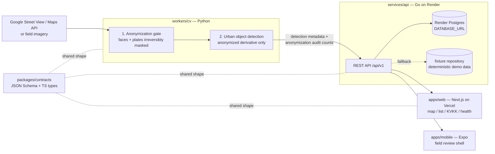

# Architecture

## Data flow

Order is a hard rule: **nothing downstream of the gate ever sees raw pixels.**
Raw imagery exists only on the local machine (`data/raw/`, gitignored) and is
deleted at hackathon end (`docs/kvkk.md`).

## Service boundaries

| Component | Owns | Does not own |
| --- | --- | --- |
| `workers/cv` | anonymization gate, object detection, result JSON | persistence, HTTP |
| `services/api` | REST endpoints, persistence, orchestration | UI, model inference |
| `apps/web` | operational dashboard, user-facing errors | business logic, raw data |
| `apps/mobile` | field-review shell | everything else (deliberately minimal) |
| `packages/contracts` | field names + invariants shared by all of the above | runtime code |

Storage holds **only anonymized derivatives and metadata** in normal
operation. Raw frames never reach the API, the database, or any deploy target.

## masterfabric-go mapping

The Go service mirrors the mandated
[masterfabric-go](https://github.com/gurkanfikretgunak/masterfabric-go)
architecture. Layer-by-layer correspondence:

| masterfabric-go | services/api | Notes |
| --- | --- | --- |
| `cmd/server/main.go` | `cmd/server/main.go` | config → logger → deps → router → graceful shutdown, same run() shape |
| `internal/domain/<ctx>/model` | `internal/domain/inventory/model` | entities: DemoRun, ImageSource, Detection, AnonymizationEvent |
| `internal/domain/<ctx>/repository` | `internal/domain/inventory/repository` | persistence ports (interfaces) |
| `internal/application/<ctx>/dto` | `internal/application/inventory/dto` | API payloads |
| `internal/application/<ctx>/usecase` | `internal/application/inventory/usecase` | one use case per file, constructor injection |
| `internal/infrastructure/http/router` | `internal/gateway` (router) | chi + same middleware order (request id → logging → recoverer → CORS) |
| `internal/infrastructure/http/handler/<ctx>` | `internal/gateway/handlers` | thin handlers → use cases → shared/response |
| `internal/infrastructure/postgres/<ctx>` | `internal/infrastructure/postgres` | adapter skeleton + `migrations/0001_init.sql` |
| — | `internal/infrastructure/memory` | deterministic fixture repository (offline demo fallback, AGENTS.md-sanctioned) |
| `internal/shared/{config,logger,response,errors,middleware}` | same | ported nearly verbatim, trimmed to MVP scope |

Deliberately omitted at scaffold stage (MVP scope, AGENTS.md "do not
overbuild"): IAM/JWT auth, multi-tenancy, Kafka/event bus, Redis cache,
OpenTelemetry, the dynamic API-management gateway. New endpoints must follow
the existing pattern: model → repository port → use case → handler → route.

## Deployment topology

- **Vercel** builds `apps/web`; `NEXT_PUBLIC_API_BASE_URL` points at Render.
- **Render** runs `services/api` (`go build -o bin/server ./cmd/server`,
  health check `/health/live`) with an attached **Render Postgres**
  (`DATABASE_URL`).
- The CV worker runs locally (laptop) during the hackathon and posts results
  toward Postgres; **Modal** may be used for training/fine-tuning compute with
  anonymized data only — it is never the product backend.
- Demo fallback chain: live API → fixture repository in the API → fixture
  snapshot embedded in the web app. The dashboard can never render blank.
